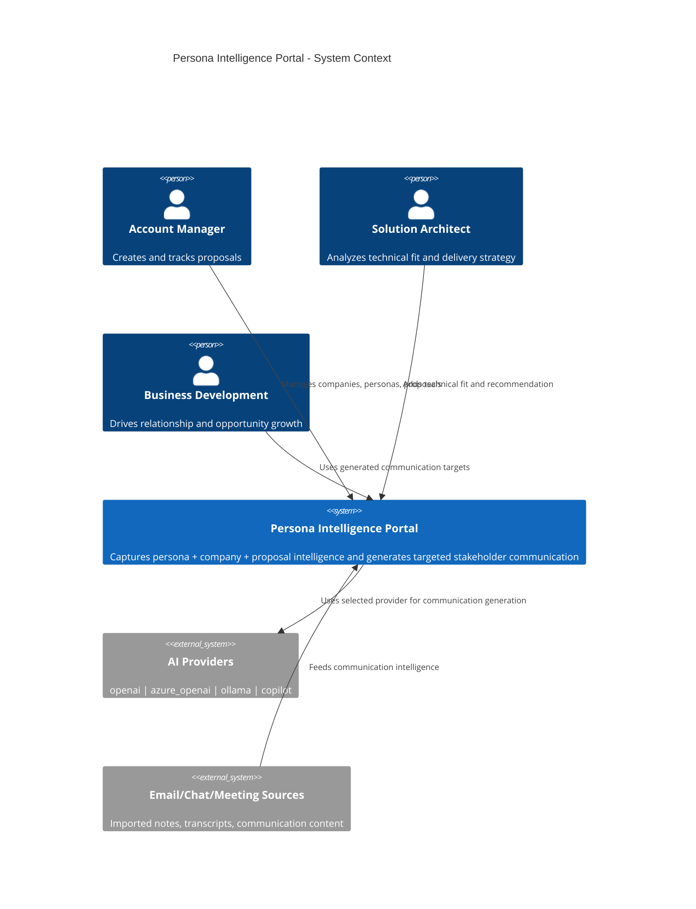
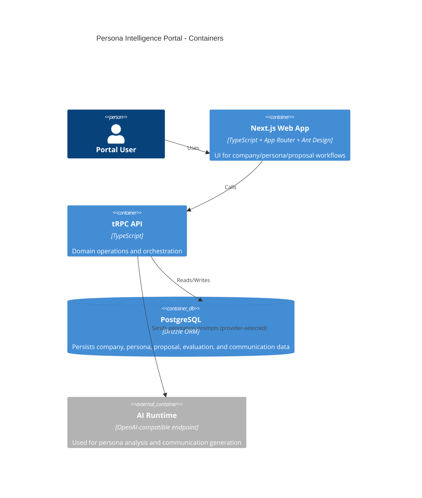
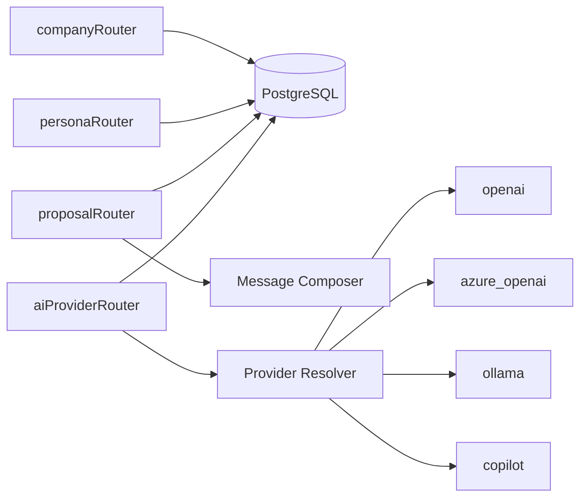
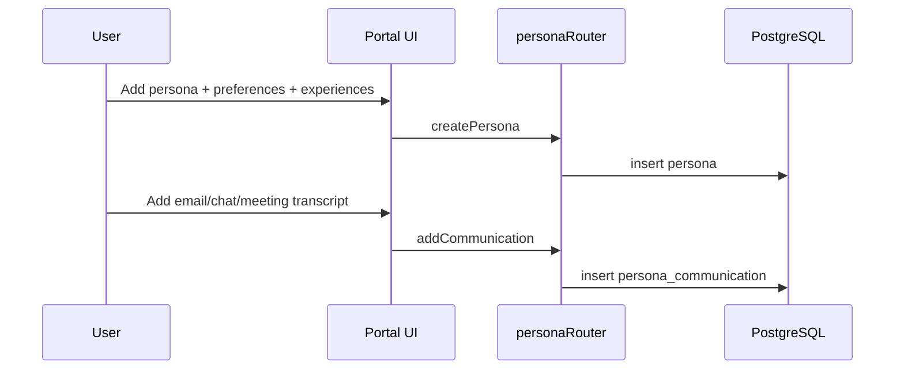
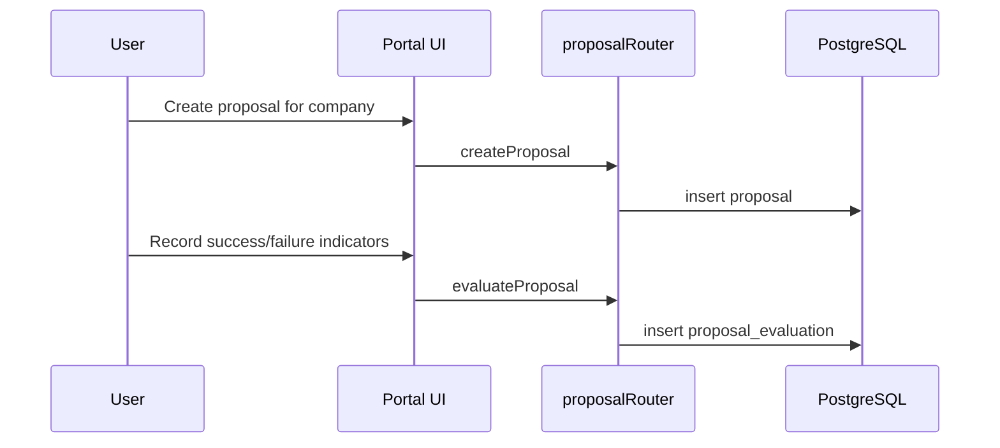
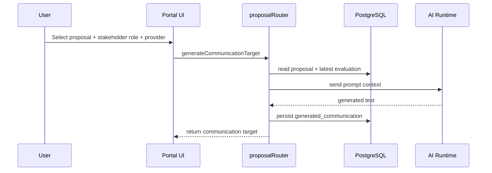

# Persona Intelligence Portal Context

## Objective
Build a portal that helps an IT services company analyze personas by company and improve proposal targeting using:
- chat conversations
- email communications
- meeting transcripts
- personality and personal preferences
- job descriptions and past experiences
- historical proposal outcomes (success/failure)
- company technology intent, development stack, standards, and partnerships

The result is a targeted communication workflow for stakeholders such as CTO, PO, Functional Tech Lead, and Tech Lead.

## C4 Model

### Level 1 - System Context


### Level 2 - Container Diagram


### Level 3 - Component Diagram (API)


## Domain Model

```mermaid
erDiagram
    COMPANY ||--o{ PERSONA : has
    COMPANY ||--o{ PROPOSAL : owns
    COMPANY ||--o{ AI_PROVIDER_CONFIG : configures
    COMPANY ||--o{ PERSONA_COMMUNICATION : stores

    PERSONA ||--o{ PERSONA_COMMUNICATION : contributes
    PERSONA ||--o{ PROPOSAL_STAKEHOLDER : linked_to

    PROPOSAL ||--o{ PROPOSAL_STAKEHOLDER : has
    PROPOSAL ||--o{ PROPOSAL_EVALUATION : evaluated_by
    PROPOSAL ||--o{ GENERATED_COMMUNICATION : produces

    PERSONA ||--o{ GENERATED_COMMUNICATION : receives

    COMPANY {
      int id PK
      string name
      string industry
      text businessIntent
      text technologyIntent
      string[] developmentStacks
      string[] certifications
      string[] standards
      string[] partnerships
      string[] referenceArchitectures
      string[] engineeringGuidelines
      timestamp createdAt
      timestamp updatedAt
    }

    PERSONA {
      int id PK
      int companyId FK
      string fullName
      string email
      text jobDescription
      text personalitySummary
      text personalPreferences
      text pastExperiences
      timestamp createdAt
      timestamp updatedAt
    }

    PERSONA_COMMUNICATION {
      int id PK
      int companyId FK
      int personaId FK
      enum type
      string subject
      text content
      json metadata
      timestamp occurredAt
      timestamp createdAt
    }

    PROPOSAL {
      int id PK
      int companyId FK
      string title
      text summary
      text intentSignals
      text technologyFit
      enum status
      enum outcome
      text outcomeReason
      timestamp createdAt
      timestamp updatedAt
    }

    PROPOSAL_STAKEHOLDER {
      int proposalId PK,FK
      int personaId PK,FK
      enum role PK
      int influenceLevel
      text notes
      timestamp createdAt
    }

    PROPOSAL_EVALUATION {
      int id PK
      int proposalId FK
      text successSignals
      text failureSignals
      int successScore
      int failureRiskScore
      text recommendation
      timestamp createdAt
    }

    AI_PROVIDER_CONFIG {
      int id PK
      int companyId FK nullable
      enum provider
      string modelName
      string endpoint
      string apiVersion
      json options
      bool isDefault
      timestamp createdAt
      timestamp updatedAt
    }

    GENERATED_COMMUNICATION {
      int id PK
      int proposalId FK
      int personaId FK nullable
      enum stakeholderRole
      enum aiProvider
      text promptContext
      text generatedMessage
      timestamp createdAt
    }
```

## Core Data Flows

### 1) Persona Intelligence Ingestion


### 2) Proposal Evaluation with Success/Failure Signals


### 3) Stakeholder Communication Generation


## AI Runtime
The portal uses a single AI runtime configuration via environment variables:
- AI_API_KEY
- AI_BASE_URL (optional, defaults to OpenAI endpoint)
- AI_MODEL (optional, defaults to gpt-4o-mini)

This keeps the user workflow focused on persona analysis and proposal targeting rather than provider administration.

## Key Aggregation Rules
- Personas are grouped by company via companyId.
- Proposal outcomes are tracked as success/failure/pending and can be correlated with stakeholder role and technical-fit signals.
- Proposal evaluations persist both success and failure signals to improve future targeting.
- Communication targets are generated for explicit stakeholder roles (CTO, PO, Functional Tech Lead, Tech Lead, Other).

## Extension Hooks
- Add ingestion adapters for Outlook, Teams, Slack, and transcript files.
- Add scoring jobs that summarize communication sentiment and influence trends.
- Add semantic retrieval for proposal history before generation.
- Add confidence scoring per generated message and A/B test tracking.
